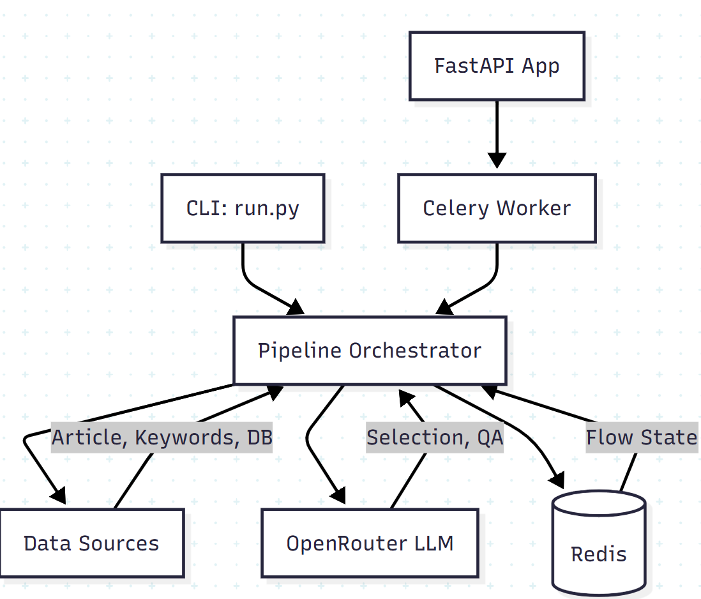
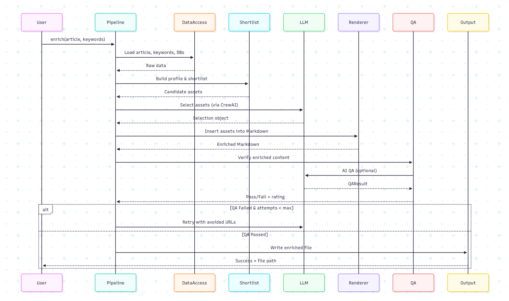

# Complete Content Enrichment Workflow: Technical Deep Dive

## Table of Contents
1. [System Overview](#system-overview)
2. [Technology Stack](#technology-stack)
3. [Architecture & Data Flow](#architecture--data-flow)
4. [Detailed Workflow Steps](#detailed-workflow-steps)
5. [AI & LLM Integration](#ai--llm-integration)
6. [Rendering Engine](#rendering-engine)
7. [Quality Assurance System](#quality-assurance-system)
8. [Deployment & Infrastructure](#deployment--infrastructure)
9. [Configuration Management](#configuration-management)
10. [Error Handling & Retry Logic](#error-handling--retry-logic)

---

## System Overview

### Purpose
The Content Enrichment Pipeline is an AI-powered system that automatically enhances Markdown articles by intelligently inserting:
- **1 Hero Image**: Eye-catching visual placed after the H1 heading
- **1 Context Media**: Image or video placed within a relevant section
- **2 Inline Hyperlinks**: Contextual links woven naturally into sentences using existing article text as anchors

### Key Innovations
1. **Natural Language Processing**: Uses Large Language Models (LLMs) to understand article context and select semantically relevant assets
2. **Intelligent Link Placement**: Extracts verbatim phrases from article text for anchors, ensuring natural inline integration
3. **Multi-Tier Matching**: 3-tier strategy (paragraph → sentence → token) for robust anchor placement
4. **AI-Driven QA**: Automated quality verification with structured feedback
5. **Retry with Diversity**: Automatically refines selections on QA rejection while avoiding repetition
6. **Multi-Modal Deployment**: CLI, Docker, and FastAPI+Celery for different use cases

---

## Technology Stack

### Core Languages & Frameworks

#### **Python 3.13**
- **Why**: Type hints, performance improvements, pattern matching
- **Usage**: Entire backend codebase
- **Key Features Used**: 
  - Pydantic for data validation
  - Type annotations throughout
  - Async support for concurrent HTTP requests

#### **uv Package Manager**
- **Why**: 10-100x faster than pip, deterministic dependency resolution
- **Usage**: All dependency management
- **Files**: `pyproject.toml` (dependencies), `uv.lock` (lock file)
- **Commands**: `uv sync` (install), `uv add <package>` (add dependency)

### AI & LLM Technologies

#### **OpenRouter API**
- **Purpose**: Gateway to multiple LLM providers (OpenAI, Anthropic, etc.)
- **Why**: Single API for multiple models, pay-per-use, no vendor lock-in
- **Model Used**: `openai/gpt-4o-mini` (configurable via `OPENROUTER_MODEL`)
- **API Endpoint**: `https://openrouter.ai/api/v1/chat/completions`
- **Configuration**:
  - `LLM_TEMPERATURE`: 0.2 (low for consistency)
  - `LLM_TIMEOUT`: 60 seconds
  - Structured JSON responses required

#### **Instructor Library**
- **Purpose**: Converts LLM responses into validated Pydantic models
- **Why**: Type-safe AI outputs, automatic retry on validation errors
- **Usage**: 
  - Asset selection: LLM → `Selection` object
  - QA verification: LLM → `QAResult` object
- **Benefits**: Schema enforcement, field validation, structured data

#### **CrewAI Framework**
- **Purpose**: Multi-agent orchestration with role-based AI agents
- **Why**: Modular agent design, built-in observability, Redis persistence
- **Components**:
  - **SelectionAgent**: Chooses hero, context media, and hyperlinks
  - **QAAgent**: Verifies enriched content  against brand guidelines
  - **EnrichmentCrew**: Coordinates agent execution
- **Opt-In**: Enabled via `USE_CREWAI_AGENTS=1`
- **Persistence**: Flow state stored in Redis (db 2) when `USE_FLOW=1`

### Data Processing

#### **httpx**
- **Purpose**: Modern HTTP client with async support
- **Why**: Better than  `requests` for concurrent operations, timeout support
- **Usage**:
  - LLM API calls (POST to OpenRouter)
  - Asset availability checks (HEAD requests to validate URLs)
  - Timeout: Configurable via `LLM_TIMEOUT`

#### **Pydantic**
- **Purpose**: Data validation and settings management
- **Why**: Runtime type checking, clear error messages, IDE support
- **Models Defined**:
  - `MediaSelection`: Hero/context media with url, alt, type, placement
  - `LinkSelection`: Hyperlink with url, anchor, keyword, placement
  - `Selection`: Complete enrichment (hero + context + 2 links)
  - `QAResult`: Acceptance verdict with rating and reasons
  - `Place`: Location specification (section_heading, paragraph_index, sentence_index)

#### **SQLite Databases**
- **Files**: `db/media.db`, `db/links.db`
- **Purpose**: Store candidate assets for selection
- **Schema**:
  - **media.db**: `id, url, alt, tags, extra_type (image/video)`
  - **links.db**: `id, url, title, description, tags, type (report/research/guide/blog)`
- **Access**: Python `sqlite3` module
- **Querying**: Simple SELECT queries, no ORM overhead

### Web Framework & API

#### **FastAPI**
- **Purpose**: Modern async web framework for REST API
- **Why**: Auto-generated OpenAPI docs, async support, type safety
- **Endpoints**:
  - `POST /tasks`: Enqueue enrichment job → Returns `task_id`
  - `GET /tasks/{task_id}`: Check status → Returns `{state, result}`
- **Server**: Uvicorn ASGI server
- **Port**: 8000 (configurable)

#### **Celery**
- **Purpose**: Distributed task queue for async job processing
- **Why**: Long-running enrichment tasks don't block API requests
- **Broker**: Redis (db 0) for task queue
- **Backend**: Redis (db 1) for result storage
- **Worker**: Separate process running `celery -A worker.celery_app worker`
- **Task**: `enrich_task(article_path, keywords_path, ...)` → Calls `pipeline.enrich()`

### Infrastructure

####  **Redis**
- **Purpose**: In-memory data store for caching and persistence
- **Why**: Fast, simple, supports multiple databases
- **Databases**:
  - **db 0**: Celery broker (task queue)
  - **db 1**: Celery backend (results)
  - **db 2**: CrewAI flow persistence (step payloads)
- **Keys**: `flow:{run_id}:{step}` (e.g., `flow:default:profile`)
- **Inspection**: `redis-cli -n 2 KEYS "flow:*"`

#### **Docker & Docker Compose**
- **Purpose**: Containerization for consistent deployment
- **Why**: Reproducible environments, easy orchestration
- **Services** (`compose.yml`):
  - **redis**: Redis server (port 6379)
  - **web**: FastAPI app (port 8000)
  - **worker**: Celery worker
- **Volumes**: Project directory mounted to `/app`
- **Environment**: Loaded from `config/.env`
- **Build**: Uses Python 3.11, installs uv, runs `uv sync`

---

## Architecture & Data Flow

### High-Level Architecture



### Component Interaction



---

## Detailed Workflow Steps

### Step 1: Initialization & Data Loading

**Entry Point**: `scripts/run.py` → `pipeline.enrich()`

**Process**:
```python
# 1. Load environment variables from config/.env
load_dotenv(dotenv_path='config/.env', override=True)

# 2. Parse command-line arguments
args = parser.parse_args()
# --article_path, --keywords_path, --model, --offline, --qa_mode

# 3. Set up logging
logger.info(f"Starting enrichment | article={article_path}")

# 4. Call pipeline
enrich(article_path, keywords_path, model, offline, qa_mode)
```

**Data Access** (`db/data_access.py`):
- **`load_article(path)`**: Reads Markdown file → Returns full text string
- **`load_keywords(path)`**: Reads txt file → Returns list of keywords
- **`load_brand_rules(path)`**: Reads brand guidelines → Returns rules text
- **` load_media_db(path)`**: Queries SQLite → Returns list of `{id, url, alt, tags, extra_type}`
- **`load_links_db(path)`**: Queries SQLite → Returns list of `{id, url, title, description, tags, type}`

**Logging**:
```
INFO Loading article from data/articles/article_1.md | size=2847 bytes
INFO Loading keywords from data/keywords/keywords_1.txt | count=2
INFO Loading brand rules from docs/brand_rules.txt | size=531 bytes
INFO Media database loaded | images=8 | videos=2
INFO Links database loaded | count=8
```

---

### Step 2: Article Profiling

**Module**: `content_enrichment/shortlist.py` → `build_article_profile()`

**Purpose**: Analyze article structure to understand context

**Process**:
1. **Extract Headings**:
   ```python
   # Parse Markdown to find all headings (# H1, ## H2, etc.)
   headings = []
   for line in article_lines:
       if line.startswith('#'):
           level = len(line) - len(line.lstrip('#'))
           text = line.lstrip('#').strip()
           headings.append({'level': level, 'text': text})
   ```

2. **Tokenize Content**:
   ```python
   # Split into word tokens for keyword matching
   tokens = set(word.lower() for word in article_text.split() if word.isalpha())
   ```

3. **Build Profile**:
   ```python
   profile = {
       'headings': headings,  # [{level, text}, ...]
       'tokens': tokens,       # {'electric', 'bicycle', 'commuting', ...}
       'length': len(article_text)
   }
   ```

**Output**: Profile dictionary with article structure and vocabulary

**Flow Persistence** (if `USE_FLOW=1`):
```python
record_step('profile', {'headings': profile['headings']})
# Stored in Redis: flow:default:profile
```

---

### Step 3: Asset Shortlisting

**Module**: `content_enrichment/shortlist.py` → `shortlist_assets()`

**Purpose**: Score and rank candidate assets by relevance

**Hero Scoring Algorithm**:
```python
def score_hero(media_item, keywords, article_tokens):
    score = 0
    
    # 1. Keyword overlap in tags/alt (50 points max)
    for keyword in keywords:
        if keyword.lower() in media_item['tags'].lower():
            score += 25
        if keyword.lower() in media_item['alt'].lower():
            score += 25
    
    # 2. Article token overlap (30 points max)
    media_tokens = set(media_item['alt'].split() + media_item['tags'].split())
    overlap = len(media_tokens & article_tokens)
    score += min(overlap * 2, 30)
    
    # 3. Prefer images for hero (20 points)
    if media_item['extra_type'] == 'image':
        score += 20
    
    return score
```

**Context Media Scoring**:
- Similar to hero but without image preference
- Considers semantic relevance to section headings

**Link Scoring**:
```python
def score_link(link_item, keywords, article_tokens):
    score = 0
    
    # 1. Link type weighting
    type_weights = {
        'report': 40,
        'research': 30,
        'guide': 20,
        'blog': 10
    }
    score += type_weights.get(link_item['type'], 0)
    
    # 2. Keyword match in title/description
    for keyword in keywords:
        if keyword.lower() in link_item['title'].lower():
            score += 25
        if keyword.lower() in link_item['description'].lower():
            score += 15
    
    # 3. Tag overlap
    # ...similar to media scoring
    
    return score
```

**Shortlist Creation**:
```python
candidates = {
    'hero': top_10_scored_media_for_hero,
    'context': top_10_scored_media_for_context,
    'links': top_10_scored_links
}
```

**Logging**:
```
INFO Shortlist complete | hero=10 | context=10 | links=10
```

---

### Step 4: Asset Availability Validation

**Module**: `content_enrichment/asset_validation.py` → `filter_candidates_by_availability()`

**Purpose**: Verify URLs are accessible before LLM selection

**Process**:
```python
import httpx
import asyncio

async def check_url(url, expected_type):
    """
    Makes HEAD request to verify URL accessibility
    
    Args:
        url: Asset URL to check
        expected_type: 'image', 'video', or 'resource'
    
    Returns:
        (url, is_available: bool)
    """
    try:
        async with httpx.AsyncClient() as client:
            response = await client.head(url, timeout=5.0)
            
            # Check status code
            if response.status_code not in [200, 301, 302]:
                return (url, False)
            
            # Verify content type if image/video expected
            if expected_type == 'image':
                content_type = response.headers.get('content-type', '')
                if not content_type.startswith('image/'):
                    return (url, False)
            
            return (url, True)
    except Exception:
        return (url, False)  # Assume unavailable on error

# Concurrent validation
results = await asyncio.gather(*[
    check_url(item['url'], expected_type)
    for item in candidates['hero']
])
```

**Filtering**:
```python
# Remove unavailable URLs
available_hero = [item for item in candidates['hero'] 
                  if item['url'] in available_urls]

if len(available_hero) < len(candidates['hero']):
    removed_count = len(candidates['hero']) - len(available_hero)
    logging.info(f"Asset availability filter | removed hero={removed_count}")
```

**Logging**:
```
INFO Asset availability filter | removed hero=1 | removed context=0 | removed links=2
```

**Benefits**:
- Prevents LLM from selecting broken/inaccessible URLs
- Reduces wasted retry attempts
- Improves user experience

---

### Step 5: AI-Powered Asset Selection

**Module**: `ai/llm_select.py` → `select_assets_with_llm()`

**CrewAI Integration** (`flows/crewai_agents.py`):
```python
# Initialize CrewAI crew (opt-in via USE_CREWAI_AGENTS=1)
crew = EnrichmentCrew()

# Run selection via SelectionAgent
selection = crew.run_selection(
    article_text=article_text,
    profile=profile,
    keywords=keywords,
    candidates=candidates,
    brand_rules_text=brand_rules_text,
    model=model,
    offline=offline
)
```

**LLM Prompt Construction**:

The prompt is meticulously crafted with multiple sections:

**1. Context Provision**:
```json
{
  "article": {
    "headings": ["H1 Title", "H2 Section", ...],
    "paragraphs": ["First paragraph text...", ...]
  },
  "keywords": ["electric bicycles", "urban mobility"]
}
```

**2. Candidate Assets**:
```json
{
  "hero_candidates": [
    {"id": 1, "url": "...", "alt": "...", "tags": "..."},
    ...
  ],
  "context_candidates": [...],
  "link_candidates": [...]
}
```

**3. Brand Rules**:
```
Alt text must be descriptive and ≤125 characters
No "Image of" or "Picture of" in alt text
No em dashes in anchor text
Headings use sentence case
...
```

**4. Critical Anchor Requirements** ⭐:
```
MANDATORY: Anchor text MUST be an exact phrase that already exists in the target sentence.
You must EXTRACT a phrase from the article text, NOT create a new descriptive phrase.
The anchor should be 2-6 words that appear verbatim in the sentence.

Example sentence: 'Survey data shows that 72% of new e-bike owners replaced at least one weekly car trip.'
  ✓ GOOD: 'weekly car trip' (exists in sentence)
  ✓ GOOD: 'e-bike owners' (exists in sentence)
  ✗ BAD: 'urban cycling adoption' (does NOT exist in sentence)
```

**5. Inline Placement Rules**:
```
The link MUST be placed WITHIN a sentence, never appended after the final period.
Find a noun phrase or descriptive phrase in the MIDDLE of the sentence.
The renderer will search for your anchor text - if not found, link fails.
Therefore: USE EXACT TEXT FROM THE SENTENCE as your anchor.
```

**6. Quality Criteria**:
```
- Anchor is 2-6 words extracted verbatim from target sentence
- Anchor contains or relates closely to the provided keyword
- Link appears MID-SENTENCE, not at the end
- Reading the sentence with the hyperlink sounds completely natural
```

**HTTP Request**:
```python
import httpx

headers = {
    'Authorization': f'Bearer {api_key}',
    'Content-Type': 'application/json'
}

body = {
    'model': 'openai/gpt-4o-mini',
    'messages': [
        {'role': 'system', 'content': 'You are a precise content selection assistant...'},
        {'role': 'user', 'content': structured_prompt}
    ],
    'temperature': 0.2,  # Low for consistency
    'response_format': {'type': 'json_object'}  # Force JSON
}

response = httpx.post(
    'https://openrouter.ai/api/v1/chat/completions',
    headers=headers,
    json=body,
    timeout=60
)
```

**Response Parsing** (via Instructor):
```python
from instructor import from_openai
from openai import OpenAI

client = from_openai(OpenAI(
    base_url='https://openrouter.ai/api/v1',
    api_key=api_key
))

# Instructor validates response against Pydantic model
selection: Selection = client.chat.completions.create(
    model=model,
    messages=[...],
    response_model=Selection,  # Pydantic validation
    temperature=0.2
)

# Result is a validated Selection object:
# selection.hero: MediaSelection
# selection.context_item: MediaSelection
# selection.links: List[LinkSelection] (exactly 2)
```

**Example LLM Response**:
```json
{
  "hero": {
    "id": 3,
    "url": "https://upload.wikimedia.org/...",
    "alt": "Commuter riding e-bike in protected bike lane",
    "type": "image",
    "extra_type": "image"
  },
  "context_item": {
    "id": 7,
    "url": "https://www.youtube.com/watch?v=...",
    "alt": "Video explaining e-bike infrastructure benefits",
    "type": "video",
    "extra_type": "video",
    "place": {
      "section_heading": "Infrastructure is catching up",
      "paragraph_index": 0
    }
  },
  "links": [
    {
      "url": "https://www.unep.org/resources/...",
      "anchor": "new e-bike owners",
      "keyword": "e-bike adoption",
      "place": {
        "section_heading": "Why commuters are switching",
        "paragraph_index": 0,
        "sentence_index": 1
      }
    },
    {
      "url": "https://itdp.org/...",
      "anchor": "protected cycle track",
      "keyword": "cycling infrastructure",
      "place": {
        "section_heading": "Infrastructure is catching up",
        "paragraph_index": 0,
        "sentence_index": 0
      }
    }
  ]
}
```

**Logging**:
```
INFO LLM config | model=openai/gpt-4o-mini | debug=off | prompt_mode=both
INFO LLM response received; parsing JSON
INFO SelectionAgent | hero=image | context=video section='Infrastructure' | links=2
```

**Fallback Selection** (if offline or LLM fails):
```python
def deterministic_fallback(candidates):
    """
    Simple rule-based selection when LLM unavailable
    """
    return Selection(
        hero=candidates['hero'][0],  # Top-scored
        context_item=candidates['context'][0],
        links=candidates['links'][:2]
    )
```

---

### Step 6: Markdown Rendering

**Module**: `content_enrichment/renderer.py` → `render_enriched_markdown()`

**Purpose**: Insert selected assets into article Markdown naturally

#### **Hero Image Insertion**

**Algorithm**:
```python
def insert_hero(lines, hero: MediaSelection):
    """
    Insert hero image immediately after H1 heading
    
    Format: 
    """
    # Find first H1 (# Title)
    h1_index = None
    for i, line in enumerate(lines):
        if line.startswith('# ') and not line.startswith('##'):
            h1_index = i
            break
    
    if h1_index is None:
        raise ValueError("No H1 heading found")
    
    # Insert after H1 with blank line padding
    hero_markdown = f""
    lines.insert(h1_index + 1, "")  # Blank line
    lines.insert(h1_index + 2, hero_markdown)
    lines.insert(h1_index + 3, "")  # Blank line
    
    logging.info(f"Renderer | hero inserted after H1 index={h1_index} type={hero.extra_type}")
```

**Example**:
```markdown
# Article Title
                    ← Blank line

                    ← Blank line
First paragraph text...
```

####  **Context Media Insertion**

**Algorithm**:
```python
def insert_context(lines, context: MediaSelection):
    """
    Insert context media after target section heading
    
    Formats:
    - Image: 
    - Video: ▶ [alt](url)
    """
    section_heading = context.place.section_heading
    
    # Find target heading
    heading_index = None
    for i, line in enumerate(lines):
        if line.startswith('#'):
            heading_text = line.lstrip('#').strip()
            if heading_text == section_heading:
                heading_index = i
                break
    
    if heading_index is None:
        logging.warning(f"Target section '{section_heading}' not found, using first H2")
        # Fallback to first H2
        heading_index = find_first_h2(lines)
    
    # Format based on type
    if context.extra_type == 'video':
        media_markdown = f"▶ [{context.alt}]({context.url})"
    else:
        media_markdown = f""
    
    # Insert after heading
    lines.insert(heading_index + 1, "")
    lines.insert(heading_index + 2, media_markdown)
    lines.insert(heading_index + 3, "")
    
    logging.info(f"Renderer | context inserted after heading='{section_heading}' index={heading_index} type={context.extra_type}")
```

#### **Inline Link Insertion** ⭐ (Most Complex)

**The Challenge**: 
- LLM provides anchor text like "new e-bike owners"
- Must find this EXACT phrase in the target sentence
- Wrap it with Markdown link syntax: `[new e-bike owners](url)`
- Handle edge cases: multi-line paragraphs, lists, punctuation

**3-Tier Matching Strategy**:

**Tier 1: Full Paragraph Search**
```python
def insert_link_tier1(paragraph, anchor, url):
    """
    Search entire paragraph for anchor text
    Avoids sentence boundary detection issues
    """
    paragraph_lower = paragraph.lower()
    anchor_lower = anchor.lower()
    
    # Find anchor position
    pos = paragraph_lower.find(anchor_lower)
    
    if pos >= 0:
        # Check word boundaries
        endpos = pos + len(anchor_lower)
        before_char = paragraph_lower[pos-1] if pos > 0 else ' '
        after_char = paragraph_lower[endpos] if endpos < len(paragraph_lower) else ' '
        
        is_word_start = not before_char.isalnum()
        is_word_end = not after_char.isalnum() or after_char in ' .,;:!?-—'
        
        if is_word_start and is_word_end:
            # Extract original case text
            before = paragraph[:pos]
            middle = paragraph[pos:endpos]  # Preserves original case
            after = paragraph[endpos:]
            
            # Build link
            new_paragraph = f"{before}[{middle}]({url}){after}"
            return new_paragraph, True
    
    return paragraph, False
```

**Tier 2: Sentence-Level Search** (Fallback)
```python
def insert_link_tier2(paragraph, anchor, url, sentence_index):
    """
    If tier 1 fails, search within specific sentence
    Uses sentence_index hint from LLM
    """
    # Split into sentences
    sentences = split_sentences(paragraph)
    
    if sentence_index < len(sentences):
        sentence = sentences[sentence_index]
        # ...same matching logic as tier 1
        if match_found:
            # Rebuild paragraph with modified sentence
            new_paragraph = reconstruct_paragraph(sentences)
            return new_paragraph, True
    
    return paragraph, False
```

**Tier 3: Token-Based Search** (Last Resort)
```python
def insert_link_tier3(paragraph, anchor, url):
    """
    If exact phrase not found, try individual words
    Example: "new e-bike owners" → try "e-bike", "owners", etc.
    """
    tokens = sorted(tokenize(anchor), key=len, reverse=True)
    
    for token in tokens:
        if len(token) < 3:  # Skip very short
            continue
        
        pos = paragraph.lower().find(token)
        if pos >= 0 and is_whole_word(paragraph, pos, token):
            # Wrap this token with link
            # ...similar to tier 1
            return modified_paragraph, True
    
    return paragraph, False
```

**Multi-Line Preservation**:
```python
def preserve_line_structure(original_lines, new_paragraph):
    """
    When inserting link in multi-line list, preserve structure
    
    Before:
    1. First item
    2. Second item  
    3. Third item
    
    After (with link in item 2):
    1. First item
    2. Second [item](url)
    3. Third item
    """
    if len(original_lines) ==  1:
        # Simple replacement
        return [new_paragraph]
    else:
        # Calculate original line lengths
        line_lengths = [len(line) for line in original_lines]
        
        # Split modified paragraph back to same number of lines
        new_lines = intelligently_split(new_paragraph, line_lengths)
        
        return new_lines
```

**Complete Insertion Function**:
```python
def _insert_link(lines, pranges, chosen_idx, anchor, keyword, url, hint_sent_idx):
    """
    Main link insertion orchestrator
    """
    pstart, pend = pranges[chosen_idx]
    original_lines = lines[pstart:pend]
    paragraph = " ".join(original_lines)
    
    inserted = False
    
    # Tier 1: Paragraph search
    new_paragraph, inserted = insert_link_tier1(paragraph, anchor, url)
    
    if not inserted:
        # Tier 2: Sentence search
        new_paragraph, inserted = insert_link_tier2(paragraph, anchor, url, hint_sent_idx)
    
    if not inserted:
        # Tier 3: Token search
        new_paragraph, inserted = insert_link_tier3(paragraph, anchor, url)
    
    if not inserted:
        # Absolute last resort: append at end
        new_paragraph = paragraph + f" [{anchor}]({url})"
        logging.warning(f"Renderer | link appended at end (anchor not found)")
    
    # Preserve line structure
    new_lines = preserve_line_structure(original_lines, new_paragraph)
    lines[pstart:pend] = new_lines
    
    logging.info(f"Renderer | link inserted in paragraph section='{section}' anchor='{anchor}'")
```

**Logging**:
```
INFO DEBUG | Searching for anchor='new e-bike owners' in paragraph (len=234)
INFO DEBUG | Found anchor in paragraph at position 127
INFO DEBUG | before=' ' after='.' word_start=True word_end=True
INFO Renderer | link inserted in paragraph section='Why commuters are switching' paragraph_idx=0 anchor='new e-bike owners' url=https://...
```

**Example Result**:
```markdown
## Why commuters are switching

Survey data published by the European Cyclists' Federation shows that
72% of [new e-bike owners](https://www.unep.org/...) replaced at least
one weekly car trip within the first three months of ownership.
```

---

### Step 7: Quality Assurance

**Module**: `ai/qa_ai.py` → `verify_with_ai()` OR `content_enrichment/qa.py` → `validate_output()`

**Two QA Modes**:

#### **AI QA Mode** (`qa_mode=ai` or `auto`)

**Process**:
```python
from instructor import from_openai
from openai import OpenAI

def verify_with_ai(markdown, selection, keywords, brand_rules):
    """
    Uses LLM to verify enriched article quality
    
    Returns: QAResult(accepted, rating, reasons, threshold)
    """
    # Build prompt
    prompt = {
        'article': markdown,
        'selection': {
            'hero': {'url': ..., 'alt': ..., 'type': ...},
            'context': {'url': ..., 'alt': ..., 'section': ...},
            'links': [{'url': ..., 'anchor': ..., 'keyword': ..., 'section': ...}, ...]
        },
        'keywords': keywords,
        'brand_rules': brand_rules,
        'criteria': [
            'Exactly one hero image after H1',
            'One in-context media under relevant section',
            'Two inline hyperlinks with descriptive anchors',
            'Alt text ≤125 characters, no "Image of" prefix',
            'No em dashes in anchors',
            'Anchors are keyword-rich and not generic'
        ]
    }
    
    # Call LLM with structured output
    client = from_openai(OpenAI(...))
    result: QAResult = client.chat.completions.create(
        model='openai/gpt-4o-mini',
        messages=[
            {'role': 'system', 'content': 'Return only the structured object'},
            {'role': 'user', 'content': str(prompt)}
        ],
        response_model=QAResult,
        temperature=0
    )
    
    return result
```

**QAResult Structure**:
```python
class QAResult(BaseModel):
    accepted: Optional[bool] = None  # Explicit acceptance
    rating: Optional[int] = None      # 0-10 scale
    reasons: List[str] = []           # Feedback list
    threshold: int = Field(default=7) # Now from QA_THRESHOLD env var!
```

**Acceptance Logic**:
```python
# Article passes if either:
# 1. Explicit acceptance: accepted == True
# 2. Rating threshold: rating >= threshold (default 7)

passed = bool(result.accepted) or (result.rating is not None and result.rating >= result.threshold)
```

**Example QA Response**:
```json
{
  "accepted": null,
  "rating": 9,
  "reasons": [
    "Hero image appropriately placed after H1",
    "Context video well-positioned in Infrastructure section",
    "Both hyperlinks use descriptive anchors with keywords",
    "Anchors extracted from article text (not generic)",
    "Alt text under 125 characters",
    "No em dashes found in content"
  ],
  "threshold": 7
}
```

**Logging**:
```
INFO QA mode: ai
INFO CrewAI | Running QAAgent task
INFO HTTP Request: POST https://openrouter.ai/api/v1/chat/completions "HTTP/1.1 200 OK"
INFO CrewAI | QAAgent completed
INFO AI QA result | accepted=None | rating=9 | threshold=7 | reasons=Hero image appropriately placed...
INFO AI QA passed
```

#### **Fallback QA Mode** (`qa_mode=fallback`)

**Process**:
```python
def validate_output(markdown, selection, keywords):
    """
    Rule-based validation when LLM unavailable
    """
    errors = []
    
    # 1. Check hero present
    if '![' not in markdown[:500]:
        errors.append("Hero image not found near article start")
    
    # 2. Check context media present
    if markdown.count('
    if link_count < 2:
        errors.append(f"Expected 2+ links, found {link_count}")
    
    # 4. Validate anchors
    for link in selection.links:
        anchor = link.anchor or ""
        
        # Check length
        if len(anchor) < 8 or len(anchor) > 80:
            errors.append(f"Anchor length out of range: '{anchor}'")
        
        # Check keyword presence
        has_keyword = any(kw.lower() in anchor.lower() for kw in keywords)
        if not has_keyword:
            errors.append(f"Anchor missing keyword: '{anchor}'")
        
        # Check not generic
        generic = ['click here', 'learn more', 'read more', 'overview']
        if anchor.lower() in generic:
            errors.append(f"Generic anchor: '{anchor}'")
    
    # 5. Check alt text
    if len(selection.hero.alt) > 125:
        errors.append(f"Hero alt text too long: {len(selection.hero.alt)} chars")
    
    if errors:
        raise ValueError("; ".join(errors))
    
    return True  # Passed all checks
```

**Logging**:
```
INFO QA mode: fallback
INFO Fallback QA passed
```

---

### Step 8: Retry & Diversity Logic

**Module**: `pipeline.py` → Main `enrich()` loop

**Purpose**: Refine selections if QA fails, while avoiding repetition

**Process**:
```python
max_attempts = int(os.getenv('RETRY_MAX_ATTEMPTS', '3'))
attempts = []
avoid_urls = set()
last_reasons = []

for attempt in range(1, max_attempts + 1):
    logging.info(f"Selection attempt {attempt}/{max_attempts}")
    
    # Get selection (avoid previous URLs)
    selection = crew.run_selection(
        article_text=article_text,
        # ...
        previous_selection=attempts[-1] if attempts else None,
        reject_reasons=last_reasons,
        avoid_urls=list(avoid_urls)
    )
    
    attempts.append(selection)
    
    # Pre-validation (anchor quality check)
    valid, score = pre_validate(selection)
    if not valid:
        logging.warning(f"Pre-validation failed | score={score} | threshold=6")
        avoid_urls.update([l.url for l in selection.links])
        continue  # Retry immediately
    
    # Render enriched markdown
    enriched_markdown = render_enriched_markdown(article_text, selection)
    
    # Record flow step
    if USE_FLOW:
        record_step(f'attempt_{attempt}', {...})
    
    # Run QA
    qa_result = crew.run_qa(enriched_markdown, selection, keywords, brand_rules)
    
    # Check acceptance
    passed = qa_result.accepted or (qa_result.rating >= qa_result.threshold)
    
    if passed:
        logging.info("AI QA passed")
        final_enriched = enriched_markdown
        break
    else:
        logging.warning(f"AI QA rejected | rating={qa_result.rating} | reasons={qa_result.reasons}")
        
        # Add URLs to avoid list
        avoid_urls.add(selection.hero.url)
        avoid_urls.add(selection.context_item.url)
        avoid_urls.update([l.url for l in selection.links])
        
        # Store rejection reasons for next attempt
        last_reasons = qa_result.reasons
        
        if attempt == max_attempts:
            raise ValueError(f"QA failed after {max_attempts} attempts")
```

**Diversity Calculation**:
```python
# After all attempts, calculate how diverse selections were
def calculate_diversity(attempts):
    all_urls = []
    for sel in attempts:
        all_urls.append(sel.hero.url)
        all_urls.append(sel.context_item.url)
        all_urls.extend([l.url for l in sel.links])
    
    unique_urls = len(set(all_urls))
    total_urls = len(all_urls)
    
    diversity = unique_urls / total_urls if total_urls > 0 else 0
    return diversity

diversity = calculate_diversity(attempts)
logging.info(f"Selection diversity | unique_ratio={diversity:.2f} | attempts={len(attempts)}")
```

**Logging**:
```
INFO Selection attempt 1/3
INFO AI QA result | accepted=None | rating=5 | threshold=7
WARN AI QA rejected | rating=5 | reasons=['Anchors are too generic', 'Missing keyword in anchor']
INFO Selection attempt 2/3
INFO Pre-validation | score=8 | threshold=6 | passed=True
INFO AI QA result | accepted=None | rating=8 | threshold=7
INFO AI QA passed
INFO Selection diversity | unique_ratio=0.75 | attempts=2
```

---

### Step 9: Output & Persistence

**Final Output**:
```python
# Determine output path
if out_path is None:
    article_name = Path(article_path).stem
    out_path = f"outputs/enriched_{article_name}.md"

# Write enriched markdown
with open(out_path, 'w', encoding='utf-8') as f:
    f.write(final_enriched)

logging.info(f"Output written: {out_path}")
logging.info(f"Done | output={out_path}")

return out_path
```

**Flow Persistence** (if `USE_FLOW=1`):
```python
# Record final acceptance
record_step('attempt_2_accepted', {
    'selection': selection.dict(),
    'qa_result': qa_result.dict(),
    'enriched_size': len(final_enriched)
})
```

**Redis Keys**:
```
flow:default:profile
flow:default:shortlist
flow:default:attempt_1
flow:default:attempt_2
flow:default:attempt_2_accepted
flow:default:render
```

**Inspection**:
```bash
# CLI
redis-cli -n 2

# Commands
KEYS "flow:*"
GET flow:default:profile
GET flow:default:attempt_2_accepted
```

---

## Deployment & Infrastructure

### CLI Deployment

**Direct Execution**:
```bash
# Install dependencies
uv sync

# Run enrichment
uv run python run.py \
  --article_path "data/articles/article_1.md" \
  --keywords_path "data/keywords/keywords_1.txt" \
  --qa_mode ai

# Output
outputs/enriched_article_1.md
logs/run_20250124_142815.log
```

**Environment**: Local machine, requires Redis if `USE_FLOW=1`

---

### Docker Compose Deployment

**Architecture**:
```yaml
services:
  redis:
    image: redis:7-alpine
    ports:
      - "6379:6379"
  
  web:
    build: .
    ports:
      - "8000:8000"
    command: uv run uvicorn api.app:app --host 0.0.0.0
    env_file: ./config/.env
    depends_on:
      - redis
  
  worker:
    build: .
    command: uv run celery -A worker.celery_app worker --loglevel=info
    env_file: ./config/.env
    depends_on:
      - redis
```

**Workflow**:
1. **Start Services**:
   ```bash
   docker compose up -d
   ```

2. **Submit Task** (via API):
   ```bash
   curl -X POST http://localhost:8000/tasks \
     -H "Content-Type: application/json" \
     -d '{
       "article_path": "/app/data/articles/article_1.md",
       "keywords_path": "/app/data/keywords/keywords_1.txt",
       "qa_mode": "ai"
     }'
   
   # Response: {"task_id": "abc123..."}
   ```

3. **Check Status**:
   ```bash
   curl http://localhost:8000/tasks/abc123...
   
   # Response: {
   #   "task_id": "abc123...",
   #   "state": "SUCCESS",
   #   "result": "/app/outputs/enriched_article_1.md"
   # }
   ```

4. **Retrieve Output**:
   ```bash
   docker cp <container>:/app/outputs/enriched_article_1.md ./local_output.md
   ```

**Benefits**:
- Isolated environment
- Horizontal scaling (multiple workers)
- Production-ready
- API access for integration

---

## Configuration Management

**All Settings** (`config/.env`):
```bash
# API Keys
OPENROUTER_API_KEY=sk-or-v1-...
OPENAI_API_KEY=sk-or-v1-...  # Same as above

# LLM Configuration
OPENROUTER_MODEL=openai/gpt-4o-mini
LLM_DEBUG=1
LLM_TIMEOUT=60  seconds
LLM_TEMPERATURE=0.2

# Content Processing
ANCHOR_SANITIZE=0
ANCHOR_REQUIRE_KEYWORDS=0
PROMPT_MODE=both  # How article sent to LLM

# QA Configuration
QA_MODE=ai
QA_THRESHOLD=7  # 0-10 acceptance rating

# Pipeline Configuration
RETRY_MAX_ATTEMPTS=2
USE_CREWAI_AGENTS=1

# Flow Persistence
USE_FLOW=1
FLOW_REDIS_URL=redis://redis:6379/2

# Celery (FastAPI)
CELERY_BROKER_URL=redis://redis:6379/0
CELERY_RESULT_BACKEND=redis://redis:6379/1
```

**Loading Priority**:
1. Environment variables (highest)
2. `config/.env` file
3. Command-line arguments
4. Code defaults (lowest)

---

## Error Handling & Retry Logic

**Network Errors**:
```python
try:
    response = httpx.post(url, timeout=60)
except httpx.TimeoutException:
    logging.error("LLM request timed out")
    # Fall back to deterministic selection
except httpx.HTTPError as e:
    logging.error(f"HTTP error: {e}")
    # Fall back to deterministic selection
```

**LLM Parse Errors**:
```python
try:
    selection = parse_llm_response(content)
except ValidationError as e:
    logging.error(f"LLM returned invalid JSON: {e}")
    # Fall back to deterministic selection
```

**QA Rejection**:
```python
if not qa_passed and attempt < max_attempts:
    logging.warning(f"Attempt {attempt} failed, retrying...")
    # Avoid previous URLs
    # Try again with different selection
else:
    raise ValueError("Max attempts exceeded")
```

**Graceful Degradation**:
- LLM unavailable → Fallback selection
- AI QA unavailable → Fallback QA
- Redis unavailable → No persistence (still works)
- Asset URL broken → Filtered before selection

---

## Summary

This content enrichment pipeline is a **sophisticated, production-ready system** that combines:

1. **Advanced AI**: LLMs for semantic understanding and content generation
2. **Robust Engineering**: Multi-tier fallbacks, retry logic, validation
3. **Intelligent Algorithms**: 3-tier anchor matching, scoring systems
4. **Modern Infrastructure**: Docker, Redis, Celery for scalability
5. **Quality Assurance**: AI-powered verification with structured feedback

**Key Strengths**:
- ✅ Natural inline link placement (not appended)
- ✅ Verbatim anchor extraction from article text
- ✅ Multi-mode deployment (CLI, Docker, API)
- ✅ Comprehensive error handling
- ✅ Observable via logging and Redis persistence
- ✅ Fully configurable via environment variables

The system handles the complete lifecycle from raw article input to polished, enriched output with minimal manual intervention.
